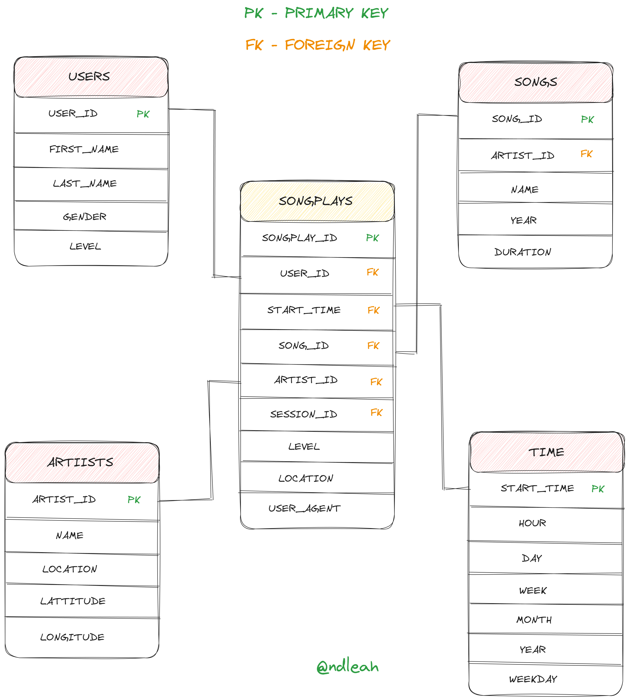

# Sparkify - Data Warehouse on AWS


## Introduction
A music streaming startup, Sparkify, has grown their user base and song database and want to move their processes and data onto the cloud. Their data resides in S3, in a directory of JSON logs on user activity on the app, as well as a directory with JSON metadata on the songs in their app.

In this project, we will create an ETL pipeline to build a data warehouses hosted on Redshift.

## Project Datasets
You'll be working with two datasets that reside in S3. Here are the S3 links for each:
* Song data: `s3://udacity-dend/song_data`
* Log data: `s3://udacity-dend/log_data`
* Log data json path: `s3://udacity-dend/log_json_path.json`

## Song Dataset
The first dataset is a subset of real data from the **[Million Song](http://millionsongdataset.com/)** Dataset. Each file is in JSON format and contains metadata about a song and the artist of that song. The files are partitioned by the first three letters of each song's track ID. For example, here are filepaths to two files in this dataset.

```
song_data/A/B/C/TRABCEI128F424C983.json
song_data/A/A/B/TRAABJL12903CDCF1A.json
```

And below is an example of what a single song file, TRAABJL12903CDCF1A.json, looks like.
```
{"num_songs": 1, "artist_id": "ARJIE2Y1187B994AB7", "artist_latitude": null, "artist_longitude": null, "artist_location": "", "artist_name": "Line Renaud", "song_id": "SOUPIRU12A6D4FA1E1", "title": "Der Kleine Dompfaff", "duration": 152.92036, "year": 0}
```

## Log Dataset
The second dataset consists of log files in JSON format generated by this event simulator based on the songs in the dataset above. These simulate app activity logs from an imaginary music streaming app based on configuration settings.
The log files in the dataset you'll be working with are partitioned by year and month. For example, here are filepaths to two files in this dataset.

```
log_data/2018/11/2018-11-12-events.json
log_data/2018/11/2018-11-13-events.json
```

## Schema for Song Play Analysis

To enable Sparkify to analyze their data effectively, they have implemented a Relational Database Schema, capable of being populated through an ETL pipeline.

This schema, commonly referred to as the star scheme, empowers the company to observe user behavior across various dimensions. The fact table, specifically designed to store user song activities categorized as "NextSong," forms the foundation for the company's ability to relate and analyze users, songs, artists, and time dimensions.

To populate the relational database, an ETL pipeline is employed, efficiently extracting the required information from both user behavior log files and corresponding master data of songs, subsequently transforming it into the schema. The distribution of facts and dimensions is automated using Redshift, eliminating the need for manual definition regarding table distribution and redundancy on individual cluster nodes.



### 1. Fact Table
* **`songplays`** - records in event data associated with song plays i.e. records with page NextSong
songplay_id, start_time, user_id, level, song_id, artist_id, session_id, location, user_agent

### 2. Dimension Tables
* **`users`** - users in the app
* **`songs`** - songs in music database
* **`artists`** - artists in music database
* **`time`** - timestamps of records in songplays broken down into specific units

##  Project Files

In order to create ETL pipeline on AWS, The project includes four files:
* **[create_table.py](create_table.py)** is where you'll create your fact and dimension tables for the star schema in Redshift.
* **[etl.py](etl.py)** is where you'll load data from S3 into staging tables on Redshift and then process that data into your analytics tables on Redshift.
* **[sql_queries.py](sql_queries.py)** is where you'll define you SQL statements, which will be imported into the two other files above.

## How to run
Run the drive program ```main.py``` as below.
```
python main.py
``` 

The ```create_tables.py``` and ```etl.py``` file can also be run independently as below:
```
python create_tables.py 
python etl.py 
```